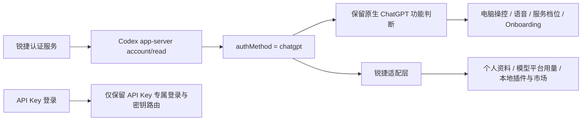

# 锐捷 Codex `authMethod` 全功能门禁审计

日期：2026-07-16
分支：`gpt-codex-0.3.1442`
基线提交：`6cb984e`

## 一句话结论

锐捷 OAuth 在真实运行时属于 `chatgpt / pro`，不是 `apikey`；本轮没有发现遗漏的 API Key 功能门禁，真正问题是旧 macOS 补丁全局改坏了 14 处原生 ChatGPT 能力判断，现已改为只精准放行插件认证门禁，并恢复个人资料、用量、插件、浏览器、电脑操控和语音等原生页面。

## 认证与能力关系

## 门禁审计结果

| 门禁或分支 | 已核实行为 | 本轮处理 | 结果 |
|---|---|---|---|
| API Key 登录、密钥展示和请求路由 | 仅适用于真正的 `apikey` 账号 | 保留，不把锐捷 OAuth 伪装成 API Key | 正确 |
| 插件支持账号类型 | 应支持 `chatgpt`、`apikey`、`amazonBedrock` | macOS、Windows、Windows ASAR 刷新统一调用精准补丁 | 已放行 |
| 使用情况和计费入口 | 锐捷账号也应显示 | 保留 `ruizhiUsageSettingsAlwaysVisible` 适配 | 已显示，剩余 99% |
| 个人资料与 Token 活动 | 使用锐捷登录态和模型平台用量 | 保留本地 profile/usage 回退 | 已显示 Pro、2.5M 累计 Token |
| 电脑操控、语音、Fast mode、Onboarding 等原生能力 | 依赖原生 `chatgpt` 判断 | 删除旧的全局 `__ruizhi_never__` 改写 | 已恢复原生判断 |
| Statsig、登录/退出、账号身份映射 | 属于身份、遥测或流程路由，不是通用功能开关 | 不做盲目放行 | 避免走错认证流程 |
| OpenAI 官方远程 `app/list` | 锐捷令牌请求官方端点仍会返回 401 | 本轮未伪造官方令牌；本地插件、技能、MCP、锐捷市场正常 | 需要后端代理或令牌交换，不属于 `authMethod` 门禁 |

## 根因与修复

旧 macOS 构建补丁曾把所有 `authMethod === \`chatgpt\`` 全局替换成永不成立的标记，成品中共误伤 14 处、5 个 bundle。该做法不只影响插件，还会关闭电脑操控账号检查、语音录制、服务档位、Onboarding、账号上下文和登录态身份等功能。

本轮修改为：

1. 删除全局替换，只识别插件账号门禁的精确代码形态。
2. 将精准补丁集中到 `patchNativePluginAuthCompatibilitySource()`。
3. macOS、Windows 和 Windows ASAR 公共刷新路径复用同一实现。
4. 增加回归测试，确保只扩展插件账号集合，不改写其他 ChatGPT 功能判断。
5. 让已打过补丁的基包可重复处理，避免日常重打版本时因重复补丁失败。

## 成品证据

| 检查项 | 结果 | 证据 |
|---|---|---|
| 成品 ASAR 旧错误标记 | `0` 处 | `__ruizhi_never__` 已清零 |
| 原生 ChatGPT 功能判断 | `17` 处 | 全部保留 |
| 插件三类账号精准门禁 | `1` 处 | `chatgpt / apikey / amazonBedrock` |
| 专项测试 | `6/6` 通过 | 插件认证、Statsig、CES |
| 完整测试文件 | `46/62` 通过 | 16 项为既有版本断言和缺失 Windows fixture，不是本轮认证回归 |
| macOS 真实页面 | 两路独立 PASS | 六页均无空白、错误态、中文裁切或控件重叠 |
| ZIP 解包签名 | 通过 | `codesign --verify --deep --strict` |
| DMG 完整性 | 通过 | `hdiutil verify` |

真实页面截图：

- `profile.png`：个人资料、Pro、Token 活动
- `usage.png`：每月限额与剩余 99%
- `plugins.png`：插件 17、MCP 1、技能 113、市场 1
- `browser.png`：内置浏览器完整设置
- `computer-use.png`：Chrome 已连接
- `voice.png`：听写、快捷键、词典、历史设置

截图目录：`.agentic/auth-method-full-feature-qa/`

## 交付产物

| 产物 | 校验值或状态 |
|---|---|
| `dist/Ruizhi-macos-0.3.1442-arm64.zip` | SHA-256 `494b8d0d2ed44138e9c5e2565b879ef014139e5e829067038984a28891bc8b0e` |
| `dist/Ruizhi-macos-0.3.1442-arm64.dmg` | SHA-256 `20941b33f4860f58a69db2a1e2ae803f827cfb945dc566c05c12303e618eb1f4` |
| macOS 应用签名 | 临时 ad-hoc 签名有效；尚未 Apple 公证 |
| Windows 安装包 | 本机缺少 Windows 官方基包/fixture，已完成公共代码与专项测试，未声称已完成 Windows 成品验收 |

## 建议动作

1. macOS 测试用户直接安装本轮 DMG，重点操作电脑操控、语音和插件开关。
2. 在 Windows 构建机导入同版本官方基包后执行构建，并重复六页验收。
3. 若要让 OpenAI 官方远程应用目录也可用，需要认证服务提供官方兼容的后端代理或令牌交换；继续改前端 `authMethod` 无法解决 401。
