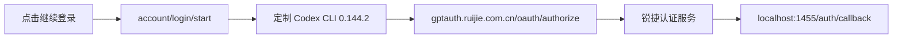

# 锐捷 Codex 登录认证路由修复报告

## 一句话结论

已按代码和成品运行行为修复：点击“继续登录”后，Codex `account/login/start` 现在生成 `https://gptauth.ruijie.com.cn/oauth/authorize`，不再生成 `https://auth.openai.com/oauth/authorize`。

## 根因分析

| 层级 | 修复前代码/运行事实 | 结论 |
|---|---|---|
| 前端按钮 | 按钮文案已改成锐捷，但点击仍调用 `loginWithChatGpt()` | 改文案不等于改认证路由 |
| 项目配置 | `config/rj-codex.json` 已有 `chatGptLoginBaseUrl=https://gptauth.ruijie.com.cn` | 项目意图是使用锐捷认证 |
| 内嵌 Codex CLI | 0.144.2 发行版在 `codex-rs/login/src/server.rs` 中将 issuer 固定为 `https://auth.openai.com` | 这是实际跳转 OpenAI 的根因 |
| 旧构建链 | 只写入 `chatgpt_login_base_url` 配置，但 0.144.2 发行版不读该字段 | 配置看似正确，运行时实际无效 |
| 版本锁定 | 构建配置仍锁定 `rust-v0.128.0-alpha.1`，桌面端实际内嵌 CLI 为 0.144.2 | 存在源码与成品版本错配 |

## 修复方案

1. 新增统一源码补丁，同时替换 OAuth 授权、刷新令牌、注销令牌三条地址。
2. Windows 和 macOS 构建脚本都必须从匹配的 `rust-v0.144.2` 源码重编 Codex CLI，不再使用无效的配置字段寄望覆盖 issuer。
3. 构建时校验桌面端内嵌 CLI 版本与源码标签版本一致。
4. macOS 在替换内嵌 CLI 后先重签子二进制，再签整个 `.app`，避免再次出现 `SIGKILL / Code Signature Invalid`。
5. macOS CI 增加 Rust 工具链、Cargo 缓存和 90 分钟超时，适配首次源码编译。

## 修复前后对比

| 检查项 | 修复前 | 修复后 | 验证状态 |
|---|---|---|---|
| 授权地址 | `auth.openai.com/oauth/authorize` | `gptauth.ruijie.com.cn/oauth/authorize` | 通过 |
| 令牌地址 | OpenAI 固定地址 | `gptauth.ruijie.com.cn/oauth/token` | 源码补丁和 OIDC 发现文档双重验证 |
| PKCE | 上游流程 | 保持 `S256` | 通过 |
| CLI 版本 | 配置 0.128 alpha，成品 0.144.2 | 源码、构建和成品均为 0.144.2 | 通过 |
| macOS 构建 | 不重编认证 CLI | 默认重编、重签、打包 | 通过 |
| Windows 构建 | 无效配置覆盖 | 同一源码补丁重编 | 源码/契约测试通过，待 Windows runner 实包 |

## 验证证据

| 验证 | 结果 |
|---|---|
| 锐捷 OIDC 发现 | issuer、authorize、token 地址均指向 `gptauth.ruijie.com.cn`，支持 PKCE `S256` |
| macOS 完整构建 | 成功生成 `.app`、ZIP、DMG |
| 成品 app-server 探测 | `account/login/start` 返回 `authUrl=https://gptauth.ruijie.com.cn/oauth/authorize?...` |
| 桌面端真实点击 | 点击“继续登录”后，页面进入“请继续在浏览器中登录”，运行日志记录 `account/login/start` |
| 认证专项测试 | 9/9 通过 |
| 完整测试 | 97 项，77 通过，20 失败；20 项与本次认证改动无关，为仓库已有的缺失 Windows 提取物、过期断言和配置冲突 |
| 代码语法 | 3 个改动脚本 `node --check` 通过 |
| macOS 签名 | `codesign --verify --deep --strict` 通过；当前为 ad-hoc 测试签名 |

## 产物

| 文件 | 大小 | SHA-256 |
|---|---:|---|
| `dist/Ruizhi-macos-0.3.1442-arm64.dmg` | 665 MB | `cb189b49fe01ea48937ec7370fbcefc6109d8db33aab0d0d4ce06d6c0b930470` |
| `dist/Ruizhi-macos-0.3.1442-arm64.zip` | 576 MB | `71124baef4b4c2af22a9016a1e5497238943c69597e15fa0f1d1831bdf00198a` |

## 尚未完成的边界

1. 未代替用户输入企业账号密码，因此没有执行 OAuth 授权后的最终账号会话验收。
2. Windows 修复已进入构建源码并有自动化测试，但本机是 macOS，尚未生成 Windows 安装包。
3. 当前 macOS 包使用 ad-hoc 签名；对外发布前仍需 Apple Developer ID 签名与公证。

## 行动建议

1. 在 Windows CI runner 上执行一次 `npm run build:windows`，并用成品 `codex.exe app-server` 重复同一条 `account/login/start` 域名断言。
2. 由一个真实锐捷账号完成一次“登录、回调、刷新令牌、退出登录”闭环验收。
3. 正式发版时必须使用 Developer ID 和 notarization，不要直接把当前 ad-hoc 包发给普通用户。
