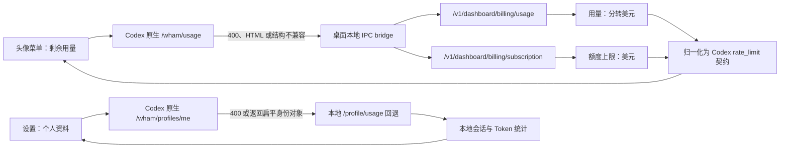

# 锐捷 Codex 模型平台用量接入报告

> 一句话结论：头像菜单“剩余用量”和设置中的“个人资料”已恢复可用；当前桌面端展示的是当前 Codex OAuth 用户在 `gptauth.ruijie.com.cn` 暴露的 OpenAI 兼容额度与本地 Token 统计。若要与网页控制台的 New API 余额、请求数和 Token 日志逐项完全一致，还需服务端提供身份映射和原生数据接口。

## 1. 本次交付结果

| 验收项 | 实际结果 | 状态 |
|---|---:|---|
| 头像菜单“剩余用量” | 每月剩余 `95%`，`Aug 1` 重置 | 通过 |
| 当前登录人额度 | 总额度 `$5.00`，已用 `$0.253896`，剩余 `$4.746104` | 通过 |
| 剩余比例核算 | `100% - 5.07792% = 94.92208%`，界面四舍五入为 `95%` | 通过 |
| 个人资料页 | `zhangteng / Pro` 正常显示，不再出现“无法加载” | 通过 |
| Token 资料 | 累计 `2.5M`、峰值 `1.8M`、当前/最长连续 `3 天` | 通过 |
| macOS 成品 | DMG、ZIP、应用深度签名均校验成功 | 通过 |
| Windows 适配 | 构建脚本与回退逻辑已同步修改 | 源码通过，未在 Windows runner 打包 |

## 2. 数据链路

## 3. 为什么原来会失败

| 问题 | 已核验证据 | 影响 |
|---|---|---|
| `/wham/profiles/me` 返回结构不符合 Codex 契约 | Codex 需要 `{profile, stats, metadata}`，服务端曾返回扁平身份字段 | 个人资料页读取 `stats` 时失败 |
| `/wham/usage` 没有返回原生用量 JSON | 实测可能返回 400 或 New API HTML 页面 | 头像菜单无法获得剩余比例 |
| New API 会话接口不接受 Codex OAuth token | `/api/user/self`、`/api/log/self/stat` 返回 `Unauthorized, invalid access token` | 桌面端不能直接读取网页控制台余额和日志 |
| 本地 bridge 被页面增强总开关误关 | 成品启动日志曾出现“页面增强服务脚本不存在”，但资源文件实际存在 | 原生接口失败后无法执行本地回退 |
| 重打版本重复下载基包 | 构建脚本每次清理并重新下载约 587 MB 官方 DMG | 修改后重新验证时间过长 |

## 4. 本次代码修改

| 文件 | 修改内容 |
|---|---|
| `resources/bridge/ruizhi-enhance-service.cjs` | 新增 `/usage/platform`，读取当前 OAuth token，合并用量与订阅额度，输出 Codex 原生用量契约 |
| `scripts/build-macos.mjs` | 对个人资料和剩余用量增加结构校验与本地回退；bridge 不再受页面增强开关控制；增加官方基包断点缓存；兼容已包装的 `.bin` Mach-O 检查 |
| `scripts/build-windows.mjs` | 同步个人资料、用量回退和 bridge 注册修复 |
| `scripts/windows-asar-overrides.mjs` | 同步 Windows 已提取 ASAR 的回退补丁 |
| `tests/ruizhi-platform-usage.test.mjs` | 覆盖金额单位转换、结构不兼容、bridge 开关、下载缓存、macOS 包装入口五个边界 |

## 5. 方案对比

| 方案 | 能否立即使用 | 身份准确性 | 维护成本 | 判断 |
|---|---:|---:|---:|---|
| 桌面端直接调用 New API `/api/*` | 否 | 未建立映射 | 中 | 当前 token 被 401 拒绝，不可用 |
| 仅显示本地 Token 统计 | 是 | 只代表本机 | 低 | 适合个人资料，不等于平台额度 |
| 兼容 billing 接口 + 本地适配 | 是 | 对应当前 Codex OAuth 用户 | 中 | 本次采用，解决“剩余用量” |
| 服务端实现原生 `/wham/usage`、`/wham/profiles/me` | 需后端配合 | 最高 | 最低（长期） | 推荐的最终架构 |
| 服务端建立 OAuth 用户与 New API 用户映射 | 需后端配合 | 可与网页控制台完全一致 | 中 | 若要同步余额、请求数、Token 日志，必须做 |

## 6. 证据边界

- 已知事实：当前 Codex OAuth token 能访问兼容 billing 接口，并得到 `$5.00` 上限与 `$0.253896` 已用额度。
- 已知事实：同一 token 不能直接访问 New API 的 `/api/user/self` 和 `/api/log/self/stat`。
- 推断判断：网页控制台截图中的超大“当前余额”属于 New API 会话账户或管理侧口径，不能在没有服务端身份映射的情况下，直接认定与桌面端 OAuth 额度是同一个字段。
- 因此，本次 UI 的 `95%` 是可验证的当前 Codex 用户兼容额度，不宣称已经同步网页控制台所有统计指标。

## 7. 仍需修改的项目问题

| 优先级 | 问题 | 具体建议 | 验收标准 |
|---|---|---|---|
| P0 | 多个 `/wham/*` 请求仍被 Electron 判定为“非 OpenAI URL”而拒绝附带认证 | 在服务端或可信域配置中正式支持 `gptauth.ruijie.com.cn`，避免每个功能单独做桌面回退 | 账户、任务、onboarding、profile、usage 请求不再出现 `Refusing to attach authentication` |
| P0 | 网页 New API 用户与 Codex OAuth 用户缺少明确映射 | 后端以 OAuth `sub/account_id/email` 映射 New API 用户，提供只读 usage 汇总接口 | 同一用户在网页和桌面端的余额、请求数、Token 数一致 |
| P1 | 服务端缺少 Codex 原生资料和用量契约 | 实现 `/wham/profiles/me`、`/wham/usage`，并增加契约测试 | 桌面端移除本地回退后仍能正常显示 |
| P1 | 全量测试存在 19 个历史失败 | 更新旧版本断言、补齐 Windows 生成型 override fixture、删除失效域名假设 | `npm test` 107/107 通过 |
| P1 | 发布基包缓存缺少远端版本指纹 | 在现有断点缓存上增加 ETag/Last-Modified 或 SHA256 校验 | 同版本重打不下载，新版本不会误用旧缓存 |
| P2 | 启动日志存在旧 skill 缺失、GCM/Statsig 噪声 | 迁移时跳过不存在的软链接；关闭企业版不使用的 GCM/Statsig 请求 | 干净启动日志中不再出现相关错误 |

## 8. 验证记录

| 验证 | 结果 |
|---|---|
| 定向测试 | `5/5` 通过 |
| 全量测试 | `108` 项中 `89` 通过、`19` 个历史失败；本次新增用例全部通过 |
| JavaScript 语法检查 | bridge、macOS、Windows 三类脚本全部通过 |
| Git diff 格式检查 | 通过 |
| 真实应用启动 | Codex CLI `0.144.2` 初始化成功；未再出现 bridge 注册失败 |
| 真实头像菜单 | 显示每月剩余 `95%`、`Aug 1` 重置 |
| 真实个人资料页 | 正常显示身份、Token 与连续使用统计 |
| 应用签名 | `codesign --verify --deep --strict` 通过 |
| ZIP | `unzip -tq` 无错误 |
| DMG | `hdiutil verify` 校验有效 |

## 9. 安装产物

- macOS 安装包：`dist/Ruizhi-macos-0.3.1442-arm64.dmg`
- macOS 更新包：`dist/Ruizhi-macos-0.3.1442-arm64.zip`
- ZIP SHA256：`494b8d0d2ed44138e9c5e2565b879ef014139e5e829067038984a28891bc8b0e`
- 说明：当前为 ad-hoc 签名，适合内部测试；正式对外分发仍应使用 Developer ID 签名并公证。
