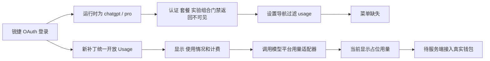

# “使用情况和计费”菜单缺失修复报告

> 纠正结论（2026-07-16）：菜单可见性问题已经修复，但用量数据尚未完成。当前“每月使用限制、100%、Aug 1”来自服务端 `$5 / $0` 占位值和客户端人为设置的 30 天窗口，不代表网页真实钱包。

## 1. 根因

当前 Codex 0.3.1442 成品已经包含完整的 `usage` 路由和页面组件，也已经能从模型平台读取额度。问题发生在设置导航过滤层：真实 `account/read` 证明锐捷 OAuth 在运行时属于 `chatgpt / pro`，但原生 `isUsageSettingsVisible` 还会受到套餐和实验条件影响；旧补丁只额外覆盖了 API Key，仍不能保证锐捷托管账号显示菜单。

## 2. 已完成修改

| 修改项 | 旧行为 | 新行为 |
|---|---|---|
| 设置菜单门禁 | 原生组合条件只额外放行 API Key | 锐捷桌面端统一显示 |
| macOS 打包 | 使用本地旧正则 | 调用共享的统一门禁补丁 |
| Windows 打包 | 使用本地旧正则 | 调用同一共享补丁，避免平台漂移 |
| 模型平台额度 | 头像菜单可见，设置页入口缺失 | 设置页入口已显示；真实钱包数据仍待服务端接入 |
| 回归测试 | 只检查脚本里是否有旧标记 | 实际执行补丁，验证 `ruizhi-oauth` 返回可见 |

核心代码位置：

- `scripts/windows-asar-overrides.mjs`：共享的 Usage 可见性源码补丁。
- `scripts/build-macos.mjs`：macOS 构建调用共享补丁。
- `scripts/build-windows.mjs`：Windows 构建调用共享补丁。
- `resources/bridge/ruizhi-enhance-service.cjs`：模型平台额度适配器。
- `tests/ruizhi-page-enhance-fixes.test.mjs`：自有 OAuth 菜单回归测试。
- `tests/ruizhi-platform-usage.test.mjs`：额度接口和映射测试。

## 3. 当前接口与真实钱包对比

2026-07-16 重新核验时，模型平台兼容接口与网页真实值如下：

| 指标 | 原始值 | 页面显示 |
|---|---:|---|
| 兼容接口总额度 | US$5.00 | 占位值，不是网页钱包 |
| 兼容接口已使用 | US$0.00 | 占位值，因此错误显示 100% |
| 网页当前余额 | US$1920.93 | 真实钱包余额 |
| 网页历史消耗 | US$79.07 | 真实累计消耗 |
| 真实剩余比例 | 96.0465% | 界面应显示约 96% |
| 重置时间 | 无月度重置 | 钱包余额不应显示 Aug 1 |

计算关系：`剩余百分比 = 1920.93 / (1920.93 + 79.07) = 96.0465%`。正式实现必须使用数据库实时值，不能把截图金额写死在客户端或服务端。

## 4. 验证结果

| 验证项 | 结果 | 证据 |
|---|---|---|
| 原问题复现 | 通过 | 修复前设置侧栏没有“使用情况和计费” |
| 自有 OAuth 回归测试 | 通过 | 自有 OAuth 返回 `isUsageSettingsVisible = true` |
| 模型平台适配器测试 | 5/5 通过 | 用量、限额、回退和打包契约均通过 |
| 真机菜单 | 通过 | 设置侧栏出现“使用情况和计费” |
| 真机页面 | 菜单通过、数据未通过 | 当前显示“每月使用限制、Aug 1、剩余 100%”，与网页不一致 |
| macOS App 签名 | 通过 | `codesign --verify --deep --strict` |
| ZIP 安装包 | 通过 | 解压后的 App 深度签名验证通过 |
| DMG 安装包 | 通过 | `hdiutil verify` 校验有效 |
| 更新清单 | 通过 | ZIP SHA-256、SHA-512、大小与清单一致 |
| 全量测试 | 97/114 通过 | 17 个为已有失败，主要是旧版本断言和缺失 Windows fixture；本次新增测试均通过 |

真机截图：`usage-settings-menu-qa-2026-07-16.png`。

## 5. 当前边界与建议

截图中的“当前套餐”和“点数余额”是 OpenAI 自有订阅、点数定价和支付接口驱动的。锐捷模型平台目前提供的是美元额度上限与消费金额，不等同于 OpenAI 点数；直接强行复用“点数余额”会造成单位错误或出现无效的“购买点数”按钮。

建议按优先级处理：

| 优先级 | 建议 | 判断 |
|---|---|---|
| P0 | 服务端按 OAuth 用户 ID 查询真实 `quota / used_quota` | 必须先完成，当前数据不真实 |
| P0 | 去掉客户端人为设置的月度窗口和重置日期 | 钱包余额不是月度套餐 |
| P1 | 新增只读“模型平台额度”卡片，显示总额、已用、剩余 | 推荐；比伪装成 OpenAI 点数更准确 |
| P1 | 把页面顶部“网页版设置”链接改为锐鉴 API 个人中心的额度页 | 推荐；避免用户进入无关页面 |
| P2 | 后端提供模型维度、日期维度消费明细接口 | 有接口后可增加趋势图和模型消费排行 |
| 不建议 | 直接显示“Pro 套餐”或“购买点数” | 当前没有对应的锐捷套餐/支付语义，会误导用户 |

## 6. 安装产物

- `dist/Ruizhi-macos-0.3.1442-arm64.dmg`
- `dist/Ruizhi-macos-0.3.1442-arm64.zip`
- ZIP SHA-256：`494b8d0d2ed44138e9c5e2565b879ef014139e5e829067038984a28891bc8b0e`
